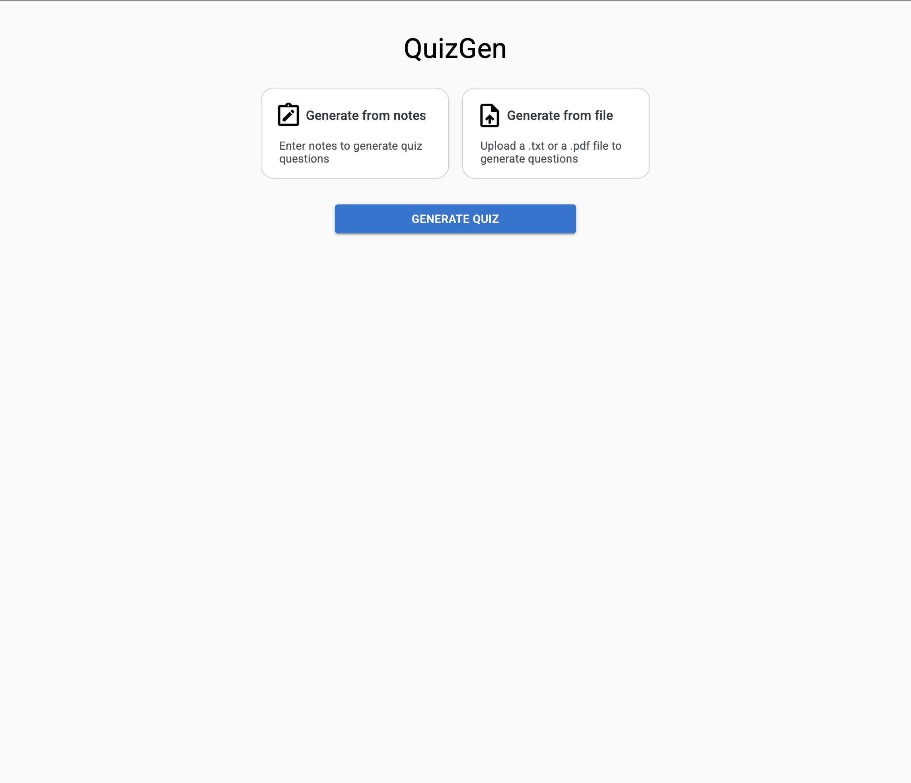
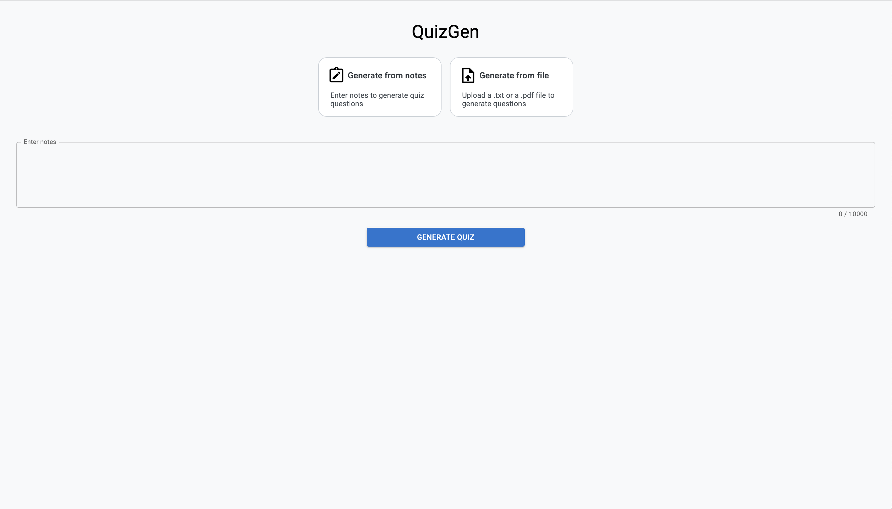
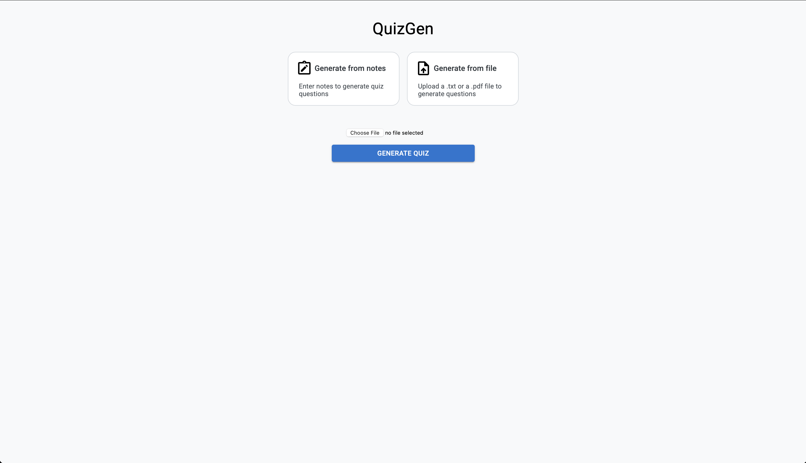
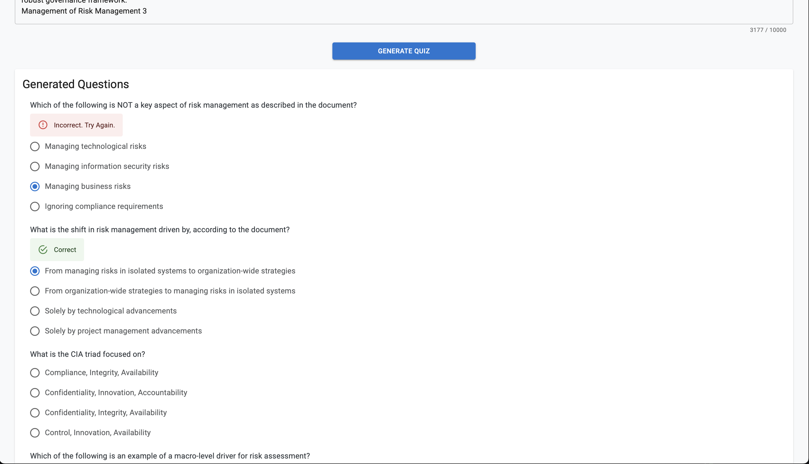

# QuizGen

QuizGen is a web application that allows users to generate quiz questions based on provided notes or uploaded text/PDF files. The app uses a React frontend with Vite and a Flask backend powered by Google's Gemini API for question generation.

## Features

- Enter notes manually or upload a `.txt` or `.pdf` file to generate quiz questions.
- Uses Google's Gemini API to generate multiple-choice questions.
- Displays the generated questions, allowing users to select answers.
- Provides feedback on whether the selected answer is correct or not.

## Frontend (React + Vite)

### Installation & Running

1. Navigate to the `frontend` directory:
   ```sh
   cd frontend
   ```
2. Install dependencies:
   ```sh
   npm install
   ```
3. Start the development server:
   ```sh
   npm run dev
   ```

## Backend (Flask API)

### Installation & Running

1. Navigate to the `backend` directory:
   ```sh
   cd backend
   ```
2. Install dependencies:
   ```sh
   pip install -r requirements.txt
   ```
3. Run the Flask server:
   ```sh
   python main.py
   ```

## API Endpoints

### 1. Generate from Notes

**Endpoint:** `POST /generatefromnotes`

- **Description:** Takes in raw text, removes special characters and extra spaces, and queries Gemini via Google's API to generate questions.
- **Request Format:**
  ```json
  {
    "notes": "Your text here"
  }
  ```
- **Response Format:**
  ```json
  [
    {
      "id": 1,
      "question": "Sample Question?",
      "answers": ["A", "B", "C", "D"],
      "correctAnswerIndex": 0
    }
  ]
  ```

### 2. Generate from File

**Endpoint:** `POST /generatefromfile`

- **Description:** Accepts a `.txt` or `.pdf` file. If a PDF contains images, extracts text using `pytesseract`, then queries Gemini as before.
- **Request Format:**
  - Multipart Form Data with file upload.
- **Response Format:**
  ```json
  [
    {
      "id": 1,
      "question": "Sample Question?",
      "answers": ["A", "B", "C", "D"],
      "correctAnswerIndex": 0
    }
  ]
  ```

## Technologies Used

### Frontend:

- React + Vite
- Material-UI
- Styled Components

### Backend:

- Flask
- Google Gemini API
- PyTesseract (for PDF image text extraction)
- PDF parsing libraries

## Future Enhancements

- Parse the files and extract more meaningfull text using NLP techniques.
- Add authentication for API usage.
- Support additional file formats.

## How it Improves Student Life

QuizGen enhances student learning by providing an efficient and interactive way to study and test knowledge. 
- Students can generate quiz questions from to their own notes, help them understand key concepts effectively.
- Automates the quiz creation process, reducing the time spent manually preparing study materials.
- Interactive multiple-choice quizzes help students be engaged and help with retention.
- Displays whether selected answers are correct, allowing students to learn from mistakes instantly.

# Demo

## The main user interface


## Generating from notes


## Generating from files


## Generated Questions with Correct or Incorrect Display


## License

This project is licensed under the MIT License.
